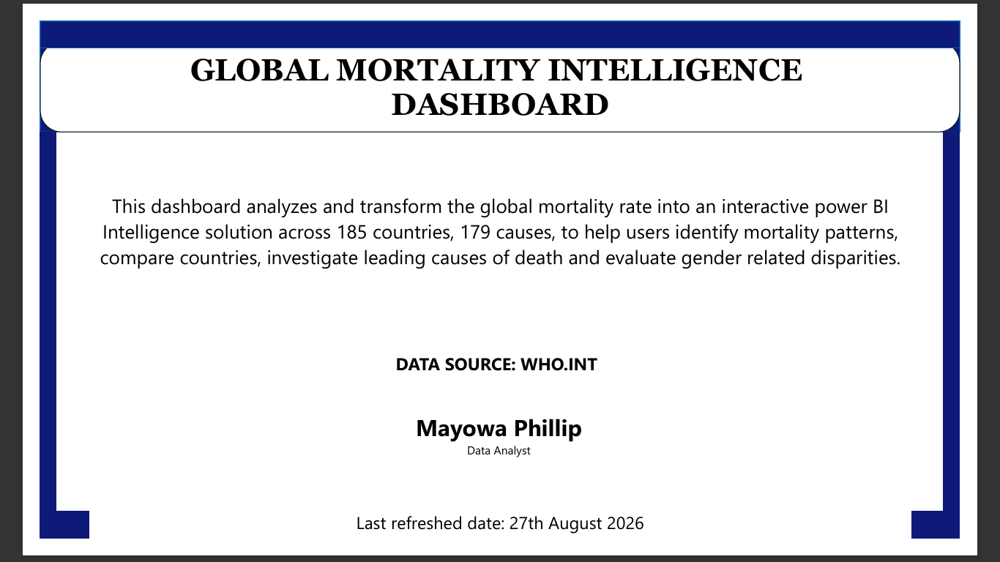
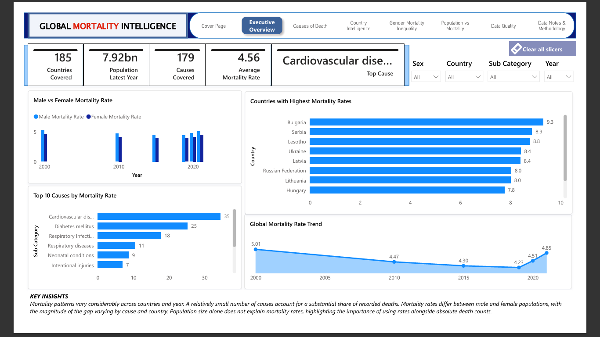
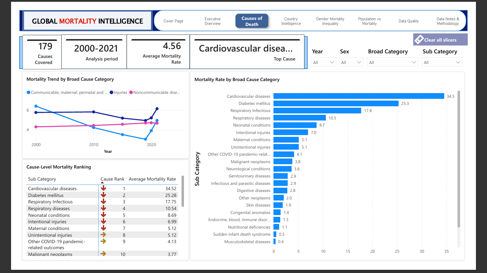
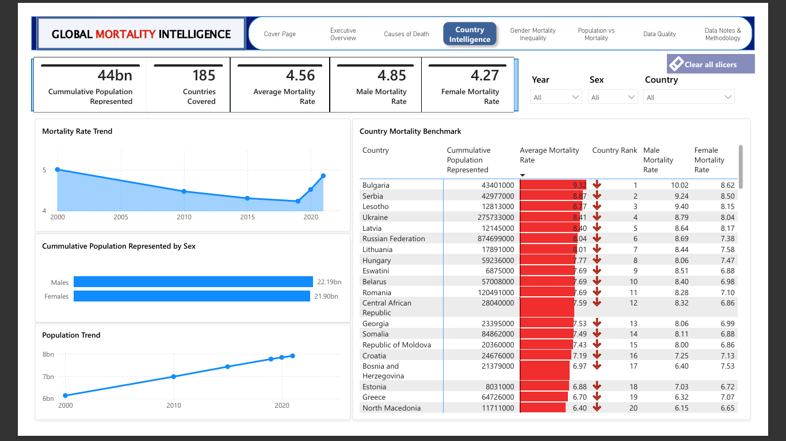
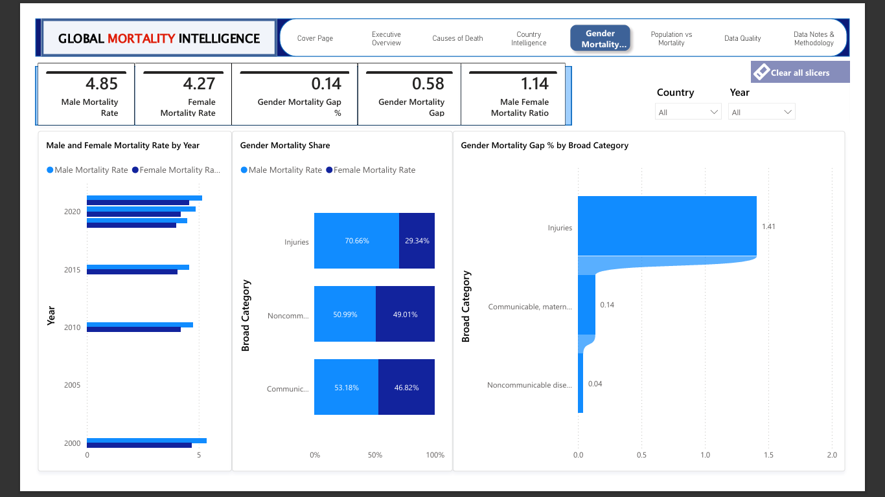
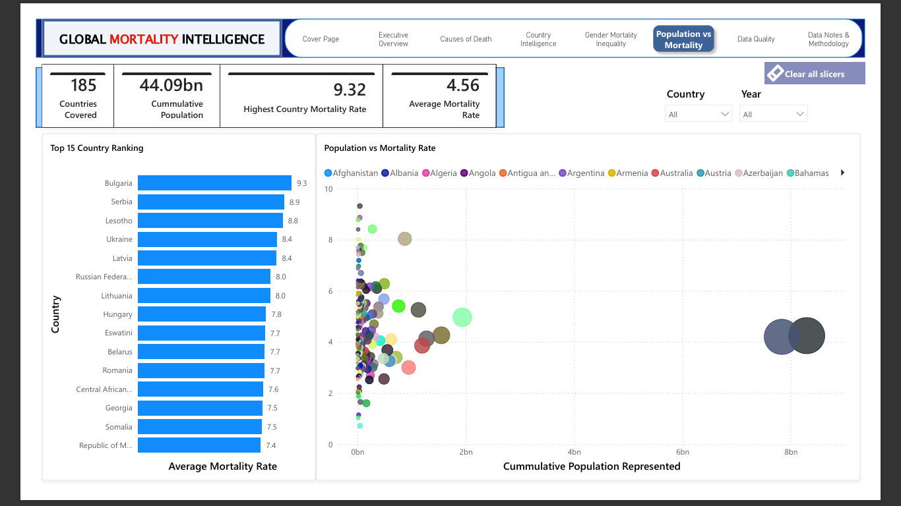
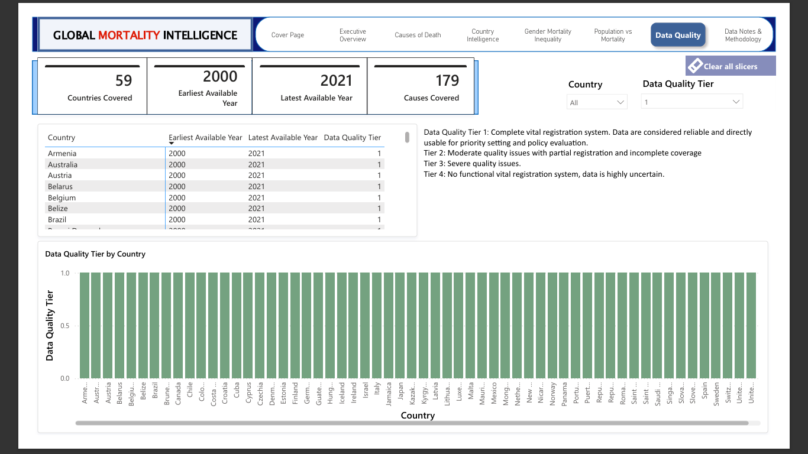
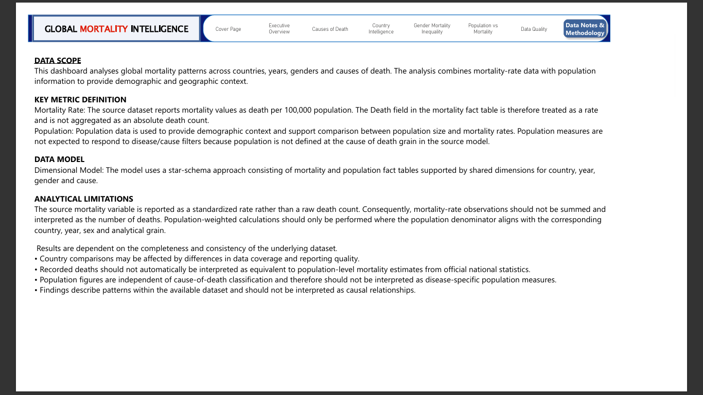

# global-mortality-intelligence
An 8-page Power BI dashboard transforming WHO mortality data across 185 countries and 179 causes into a global health intelligence solution — covering cause rankings, country benchmarking, gender inequality, and data quality analysis.
# 🌍 Global Mortality Intelligence Dashboard

<div align="center">


**Transforming global mortality data into actionable public health intelligence across 185 countries, 179 causes of death, and 22 years of WHO data.**

[View Dashboard Pages](#-dashboard-pages--insights) · [Key Findings](#-key-findings--recommendations) · [Data Notes](#-data-notes--methodology) · [Author](#-author)

</div>

---

## 📌 Project Overview

Mortality data is one of the most powerful lenses through which we understand global health. Yet raw mortality datasets from the World Health Organization are dense, multi-dimensional, and inaccessible to most decision-makers without transformation.

This **Global Mortality Intelligence Dashboard** converts WHO mortality and population data into an 8-page interactive Power BI solution — enabling public health professionals, researchers, policymakers, and global health organisations to:

- Identify mortality patterns across countries and time periods
- Compare cause-of-death rankings between nations and demographic groups
- Investigate gender-related mortality disparities
- Benchmark countries against each other on standardised mortality rates
- Evaluate data quality and coverage before drawing policy conclusions

> **Data Source:** WHO Global Health Observatory — [who.int](https://www.who.int)
> **Last Refreshed:** 27th August 2026
> **Analysis Period:** 2000 – 2021

---

## 🎯 Objective

To design a comprehensive, multi-page Power BI intelligence solution that transforms raw WHO mortality-rate data into a decision-ready dashboard — enabling global health stakeholders to investigate mortality trends, compare countries, identify leading causes of death, and evaluate gender-related disparities across a 22-year time horizon.

---

## ❓ Problem Statement

Despite being publicly available, WHO global mortality data is rarely presented in a way that enables fast, comparative analysis. Decision-makers face several challenges:

1. **Scale**: 185 countries × 179 causes × 22 years produces millions of rows of data with no intuitive structure for non-technical users
2. **Gender blind spots**: Raw totals mask significant male-female mortality disparities that vary by cause and region
3. **Population vs. rate confusion**: High-population countries dominate absolute counts, obscuring which nations have the worst standardised mortality rates
4. **Data quality uncertainty**: Not all countries have complete vital registration systems — insights drawn from low-quality data can be misleading
5. **No synthesis**: Existing WHO reports address specific diseases or regions in isolation; no single view exists for cross-cutting comparison

This dashboard was built to solve all five challenges in one unified intelligence solution.

---

## 🏆 Goals

- Deliver an executive-level overview with headline KPIs visible at a glance
- Build a dedicated **Causes of Death** page ranking all 179 causes by average mortality rate
- Create a **Country Intelligence** page with full benchmarking across all 185 countries including male/female breakdowns
- Design a **Gender Mortality Inequality** page quantifying the gap between male and female mortality across cause categories
- Build a **Population vs. Mortality** scatter page proving that population size does not explain mortality rate — a critical analytical insight
- Include a **Data Quality** page allowing users to filter analysis to only high-quality Tier 1 countries
- Provide a **Data Notes & Methodology** page that meets international transparency standards for public health reporting

---

## 🖼️ Dashboard Preview

### Cover Page


### Page 1 — Executive Overview


### Page 2 — Causes of Death


### Page 3 — Country Intelligence


### Page 4 — Gender Mortality Inequality


### Page 5 — Population vs. Mortality


### Page 6 — Data Quality


### Page 7 — Data Notes & Methodology


---

## 🔢 Key Metrics at a Glance

| Metric | Value |
|---|---|
| Countries Covered | 185 |
| Causes of Death Covered | 179 |
| Analysis Period | 2000 – 2021 |
| Population Represented (Latest Year) | 7.92 billion |
| Cumulative Population (All Years) | 44.09 billion |
| Average Global Mortality Rate | 4.56 per 100,000 |
| Top Cause of Death | Cardiovascular Diseases |
| Highest Country Mortality Rate | 9.32 (Bulgaria) |
| Male Mortality Rate | 4.85 |
| Female Mortality Rate | 4.27 |
| Gender Mortality Gap | 0.58 |
| Male-to-Female Mortality Ratio | 1.14 |
| Gender Mortality Gap % | 0.14% |
| Tier 1 Data Quality Countries | 59 |

> **Note:** Mortality Rate is expressed as deaths per 100,000 population (standardised rate), not as an absolute death count.

---

## 📋 Dashboard Pages & Insights

### Page 1 — Executive Overview
A high-level intelligence summary for senior stakeholders and decision-makers.

- **185 countries** covered with a global population of **7.92 billion** (latest year)
- **Average global mortality rate of 4.56** per 100,000 population, with Cardiovascular Disease as the top cause
- **Global Mortality Rate Trend (2000–2021)**: Rate declined from 5.01 in 2000 to a low of 4.23 in 2018, before rising again to 4.85 in 2021 — likely reflecting the impact of the COVID-19 pandemic
- **Male mortality rate consistently exceeds female** across all years, with the gap most visible in the 2020–2021 period
- **Top 10 causes by mortality rate**:
  1. Cardiovascular diseases — 35
  2. Diabetes mellitus — 25
  3. Respiratory Infectious — 18
  4. Respiratory diseases — 11
  5. Neonatal conditions — 9
  6. Intentional injuries — 7
- **Countries with highest mortality rates**: Bulgaria (9.3), Serbia (8.9), Lesotho (8.8), Ukraine (8.4), Latvia (8.4), Russian Federation (8.0), Lithuania (8.0), Hungary (7.8)
- **Key insight**: Eastern European nations dominate the highest mortality rankings — cardiovascular disease prevalence, lifestyle factors, and healthcare system capacity are likely contributing factors

---

### Page 2 — Causes of Death
A comprehensive ranking and trend analysis of all 179 causes of death.

- **Analysis period: 2000–2021** | Average mortality rate: **4.56** | Top cause: **Cardiovascular diseases**
- **Full cause-level mortality ranking** (top 10):

| Rank | Sub Category | Avg. Mortality Rate |
|---|---|---|
| 1 | Cardiovascular diseases | 34.52 |
| 2 | Diabetes mellitus | 25.28 |
| 3 | Respiratory Infectious | 17.75 |
| 4 | Respiratory diseases | 10.54 |
| 5 | Neonatal conditions | 8.69 |
| 6 | Intentional injuries | 6.99 |
| 7 | Maternal conditions | 5.12 |
| 8 | Unintentional injuries | 5.12 |
| 9 | Other COVID-19 pandemic-related outcomes | 4.13 |
| 10 | Malignant neoplasms | 3.77 |

- **Mortality trend by broad cause category (2000–2021)**:
  - Communicable, maternal, perinatal and nutritional conditions: declining trend — reflecting progress in global health programmes
  - Noncommunicable diseases: rising trend — indicating an epidemiological transition globally
  - Injuries: relatively stable with a slight decline
- **The rise of non-communicable diseases** (NCDs) as the dominant mortality driver represents one of the most significant global health shifts of the 21st century
- **COVID-19 pandemic-related outcomes** appear as a distinct category, confirming its measurable impact on global mortality rates from 2020 onwards

---

### Page 3 — Country Intelligence
Full country-level benchmarking with male and female mortality breakdowns.

- **Cumulative population represented**: 44 billion | **185 countries** | **Average mortality rate**: 4.56
- **Male mortality rate (4.85) exceeds female (4.27)** globally — a consistent pattern across all countries
- **Country Mortality Benchmark** (top 20 by mortality rate):

| Rank | Country | Avg. Mortality Rate | Male Rate | Female Rate |
|---|---|---|---|---|
| 1 | Bulgaria | 9.32 | 10.02 | 8.62 |
| 2 | Serbia | 8.87 | 9.24 | 8.50 |
| 3 | Lesotho | 8.77 | 9.40 | 8.15 |
| 4 | Ukraine | 8.41 | 8.79 | 8.04 |
| 5 | Latvia | 8.40 | 8.64 | 8.17 |
| 6 | Russian Federation | 8.04 | 8.69 | 7.38 |
| 7 | Lithuania | 8.01 | 8.44 | 7.58 |
| 8 | Hungary | 7.77 | 8.06 | 7.47 |
| 9 | Eswatini | 7.69 | 8.51 | 6.88 |
| 10 | Belarus | 7.69 | 8.40 | 6.98 |

- **Population trend**: Global cumulative population represented grew from ~6 billion in 2000 to ~8 billion by 2021
- **Population by sex**: Males (22.19 billion cumulative) slightly exceed females (21.90 billion) across the dataset
- **Critical insight**: Population size does not explain mortality rank — small countries like Lesotho (population ~1.3M) rank among the world's highest mortality nations

---

### Page 4 — Gender Mortality Inequality
A dedicated page quantifying the mortality gap between male and female populations.

- **Male mortality rate**: 4.85 | **Female mortality rate**: 4.27 | **Gap**: 0.58 | **Ratio**: 1.14
- **Gender Mortality Gap % by Broad Category**:
  - Injuries: **1.41** — by far the largest gender gap, with men far more likely to die from injuries
  - Communicable, maternal, perinatal and nutritional conditions: **0.14**
  - Noncommunicable diseases: **0.04** — smallest gap, suggesting more equal burden
- **Gender Mortality Share by Broad Category**:
  - Injuries: 70.66% Male vs. 29.34% Female — men are more than twice as likely to die from injuries
  - Noncommunicable diseases: 50.99% Male vs. 49.01% Female — near parity
  - Communicable diseases: 53.18% Male vs. 46.82% Female — moderate male excess
- **Male and Female Mortality Rate by Year**: Male rates consistently exceed female across every year from 2000 to 2021, with the gap widening slightly in more recent years
- **Key insight**: The injury mortality gap is the most pronounced gender disparity in global health — driven by occupational hazards, road traffic accidents, and conflict-related deaths disproportionately affecting males

---

### Page 5 — Population vs. Mortality
A scatter analysis disproving the assumption that large populations drive high mortality rates.

- **185 countries** | **Cumulative population**: 44.09 billion | **Highest country mortality rate**: 9.32
- **Population vs. Mortality Rate scatter plot**: Countries are plotted by cumulative population (x-axis) against average mortality rate (y-axis)
  - The scatter shows **no positive correlation** between population size and mortality rate
  - The two largest population clusters (China and India, far right on the x-axis) sit at average mortality rates of approximately 4, well below the highest-mortality nations
  - High-mortality countries cluster in the **left portion of the chart** — small populations, very high mortality rates
- **Top 15 country ranking**: Bulgaria, Serbia, Lesotho, Ukraine, Latvia, Russian Federation, Lithuania, Hungary, Eswatini, Belarus, Romania, Central African Republic, Georgia, Somalia, Republic of Moldova
- **Key insight**: Mortality rate is driven by healthcare system capacity, disease burden, lifestyle factors, and socioeconomic conditions — not by population size. This page is critical for analysts who must not confuse absolute death counts with standardised rates

---

### Page 6 — Data Quality
A transparency page allowing users to filter analysis to countries with reliable data only.

- **59 countries** with Tier 1 data quality (complete vital registration system, data directly usable for policy)
- **Data Quality Tier definitions**:
  - **Tier 1**: Complete vital registration system — data considered reliable and directly usable for priority setting and policy evaluation
  - **Tier 2**: Moderate quality issues with partial registration and incomplete coverage
  - **Tier 3**: Severe quality issues
  - **Tier 4**: No functional vital registration system — data highly uncertain
- **Earliest available year**: 2000 | **Latest available year**: 2021 | **Causes covered**: 179
- All 59 Tier 1 countries have complete data from 2000–2021
- **Key insight**: Users conducting rigorous policy analysis should filter to Tier 1 countries only. Cross-country comparisons that include Tier 3 and 4 nations should be interpreted with caution

---

### Page 7 — Data Notes & Methodology
Full methodological transparency page meeting international public health reporting standards.

**Data Scope**: This dashboard analyses global mortality patterns across countries, years, genders, and causes of death. The analysis combines mortality-rate data with population information to provide demographic and geographic context.

**Key Metric Definitions**:
- **Mortality Rate**: Expressed as deaths per 100,000 population (standardised rate). The Death field in the mortality fact table is treated as a rate and is not aggregated as an absolute death count
- **Population**: Used to provide demographic context and support comparison between population size and mortality rates. Population measures do not respond to disease/cause filters because population is not defined at the cause-of-death grain in the source model

**Data Model**: Star-schema approach consisting of mortality and population fact tables supported by shared dimensions for country, year, gender, and cause

**Analytical Limitations**:
- Mortality-rate observations should not be summed or interpreted as the number of deaths
- Population-weighted calculations should only be performed where the population denominator aligns with the corresponding country, year, sex, and analytical grain
- Country comparisons may be affected by differences in data coverage and reporting quality
- Recorded deaths should not automatically be interpreted as equivalent to population-level mortality estimates from official national statistics
- Population figures are independent of cause-of-death classification and should not be interpreted as disease-specific population measures
- Findings describe patterns within the available dataset and should not be interpreted as causal relationships

---

## 💡 Key Findings & Recommendations

### 1. 🔴 Cardiovascular disease is the leading cause of death globally — by a wide margin
At a mortality rate of 34.52, cardiovascular diseases are nearly 10 points ahead of the second-ranked cause (Diabetes mellitus, 25.28). Recommended action: global health investment and national health strategies should prioritise cardiovascular prevention, screening, and treatment programmes.

### 2. 🔴 Bulgaria has the world's highest mortality rate (9.32) — more than double the global average
Eastern European nations occupy 7 of the top 10 slots. Recommended action: targeted public health interventions focusing on cardiovascular disease, lifestyle factors, and healthcare system strengthening are urgently needed in this region.

### 3. 🔴 Global mortality rate rose from 4.23 in 2018 to 4.85 in 2021
After 18 years of decline, the reversal in 2020–2021 is directly attributable to the COVID-19 pandemic. Recommended action: global pandemic preparedness investment should be treated as a mortality prevention strategy, not just a public health emergency response.

### 4. 🟡 Men are 1.14× more likely to die than women globally
The male-to-female mortality ratio of 1.14 is driven primarily by the injury category, where men account for 70.66% of deaths. Recommended action: occupational safety, road traffic safety, and mental health programmes targeting men could significantly narrow this gap.

### 5. 🟡 Non-communicable diseases are rising while communicable diseases decline
The epidemiological transition is clearly visible in the trend data — NCDs are becoming the dominant global health burden. Recommended action: global health funding must rebalance toward NCD prevention and management, not just infectious disease control.

### 6. 🟡 Lesotho (population ~1.3M) ranks 3rd highest globally for mortality rate
This disproves any assumption that high mortality is simply a function of large populations. Recommended action: small, high-mortality nations need proportionally greater international health support relative to their population size.

### 7. 🟢 59 countries have complete, policy-grade Tier 1 data
More than two-thirds of countries still have incomplete vital registration systems. Recommended action: investment in civil registration and vital statistics (CRVS) infrastructure in Tier 3 and 4 countries would dramatically improve global health intelligence and policy effectiveness.

### 8. 🟢 Population size does not predict mortality rate
The scatter analysis confirms that the world's most populous nations are not the deadliest per capita. Recommended action: global health prioritisation frameworks must use standardised mortality rates, not absolute death counts, to identify where intervention is most needed.

---

## 🛠️ Tools & Technologies

| Tool | Purpose |
|---|---|
| **Power BI Desktop** | Dashboard design, layout, navigation, and publishing |
| **Power Query (M Language)** | Data ingestion, cleaning, reshaping, and transformation |
| **DAX** | Custom measures — mortality rate calculations, gender gap metrics, MoM trends, country rankings, data quality filters |
| **Star Schema Data Model** | Mortality and population fact tables with shared country, year, gender, and cause dimensions |
| **WHO Global Health Observatory** | Primary data source (mortality rates per 100,000 population) |

---

## 📐 Data Model

```
┌─────────────────┐     ┌──────────────────────┐     ┌─────────────────┐
│  dim_Country    │────▶│  fact_Mortality       │◀────│  dim_Cause      │
│  - CountryID    │     │  - CountryID (FK)     │     │  - CauseID      │
│  - CountryName  │     │  - YearID (FK)        │     │  - SubCategory  │
│  - Region       │     │  - GenderID (FK)      │     │  - BroadCategory│
│  - DataQualityT │     │  - CauseID (FK)       │     └─────────────────┘
└─────────────────┘     │  - MortalityRate      │
                        └──────────────────────┘
┌─────────────────┐           │
│  dim_Year       │───────────┘     ┌──────────────────────┐
│  - YearID       │                 │  fact_Population     │
│  - Year         │────────────────▶│  - CountryID (FK)    │
└─────────────────┘                 │  - YearID (FK)       │
                                    │  - GenderID (FK)     │
┌─────────────────┐                 │  - Population        │
│  dim_Gender     │────────────────▶└──────────────────────┘
│  - GenderID     │
│  - Sex          │
└─────────────────┘
```

> Star-schema approach with two fact tables (mortality and population) and four shared dimension tables. Population is not filtered by cause of death — it operates at country/year/gender grain only.

---

## ⚠️ Analytical Limitations

Please read before drawing conclusions from this dashboard:

1. **Rates, not counts**: All mortality values are standardised rates (per 100,000 population), not absolute death counts. Do not sum mortality rates across causes or countries.

2. **Data quality variance**: 126 of 185 countries are below Tier 1 data quality. Cross-country comparisons involving Tier 3 and 4 nations carry significant uncertainty. Use the Data Quality page to filter where needed.

3. **No causal inference**: This dashboard identifies correlations and patterns. Findings should not be interpreted as causal relationships between factors and mortality outcomes.

4. **Population independence**: Population figures do not respond to cause-of-death filters. They are provided for demographic context only, not for disease-specific population weighting.

5. **Coverage gaps**: Not all 185 countries have data for all 179 causes across all 22 years. Data completeness varies by country and cause category.

---

## 📁 Project Structure

```
global-mortality-intelligence/
│
├── README.md
├── data/
│   ├── raw/
│   │   ├── who_mortality_data.csv         # Raw WHO mortality dataset
│   │   └── who_population_data.csv        # Raw WHO population dataset
│   └── cleaned/
│       ├── mortality_cleaned.csv          # Cleaned mortality fact table
│       └── population_cleaned.csv         # Cleaned population fact table
│
├── dashboard/
│   └── Global_Mortality_Intelligence.pbix # Power BI file
│
├── images/
│   ├── cover_page.png
│   ├── executive_overview.png
│   ├── causes_of_death.png
│   ├── country_intelligence.png
│   ├── gender_mortality_inequality.png
│   ├── population_vs_mortality.png
│   ├── data_quality.png
│   └── data_notes_methodology.png
│
└── docs/
    └── Global_Mortality_Intelligence.pdf  # Exported PDF version
```

---

## 🚀 How to Use

1. Clone or download this repository
2. Open `dashboard/Global_Mortality_Intelligence.pbix` in **Power BI Desktop**
3. If prompted, update the data source paths to point to the files in `data/cleaned/`
4. Use the **Clear all slicers** button (top right of each page) to reset all filters
5. Navigate using the top navigation bar:

```
Cover Page → Executive Overview → Causes of Death → Country Intelligence
→ Gender Mortality Inequality → Population vs Mortality → Data Quality → Data Notes & Methodology
```

6. **Recommended workflow for policy analysis**:
   - Start on **Executive Overview** for headline context
   - Go to **Data Quality** and filter to Tier 1 countries before drawing conclusions
   - Use **Country Intelligence** to benchmark specific nations
   - Use **Gender Mortality Inequality** to investigate sex-disaggregated patterns
   - Review **Data Notes & Methodology** before citing findings

---

## 📊 Use Cases

This dashboard is designed for:

| Audience | Use Case |
|---|---|
| **Public Health Officials** | Monitoring national mortality trends and benchmarking against global averages |
| **Policy Researchers** | Identifying high-burden causes and countries for targeted intervention |
| **Global Health Organisations** | Cross-country comparative analysis for funding prioritisation |
| **Academic Researchers** | Exploratory analysis of WHO mortality patterns across causes and demographics |
| **Data Analysts** | Portfolio demonstration of advanced Power BI, DAX, and data modelling skills |
| **Journalists & Media** | Evidence-based reporting on global health trends |

---

## 📜 License & Attribution

**Data**: This dashboard uses publicly available data from the World Health Organization Global Health Observatory ([who.int](https://www.who.int)). All WHO data is used in accordance with their open data terms.

**Dashboard**: © 2026 Mayowa Phillip. This project is shared for portfolio and educational purposes. The `.pbix` file and associated assets may not be redistributed commercially without written permission.

---

## 👤 Author

<div align="center">

**Mayowa Phillip**
*Data Analyst*

[](mailto:mayowaphillip@yahoo.com)
[](https://linkedin.com/in/mayowaphillipelnuk)
[](https://github.com/mayowaphillip)

</div>

---

<div align="center">

*Built with Power BI · DAX · Power Query · WHO Global Health Observatory Data*

⭐ If this project was useful to you, consider starring the repository.

</div>
